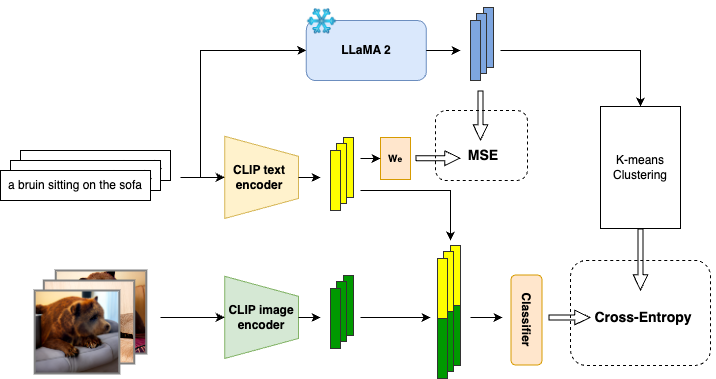

# KKLIP: Knowledge Distillation Exploiting K-means Clustering for Language-Image Pre-Training

[](https://img.shields.io/badge/Version-v0.1.0-blue)
[](https://opensource.org/licenses/MIT)
[](https://github.com/huggingface/transformers)


arXiv link: https://arxiv.org/abs/2205.00305

To be published in [**Findings of NAACL 2022**](https://2022.naacl.org/)

Authors:
[Chin-Lun Fu](https://allen0307.github.io/), 
[Chun-Yao Chang](https://www.linkedin.com/in/chun-yao-chang/),
[Kuei-Chun Kao](https://www.linkedin.com/in/kuei-chun-kao/),
[Nanyun (Violet) Peng](https://vnpeng.net/)

## Overview


In this study, we introduces KKLIP, a novel approach designed to enhance the quality of CLIP by incorporating a new knowledge distillation (KD) method derived from Llama 2. Our method comprises three objectives: Text Embedding Distillation, Concept Learning, and Contrastive Learning.

### Dataset

We use [CC15M](https://huggingface.co/datasets/yxchng/cc15m_yfcc15m) as our dataset. You can download all datasets from the website.

### Pre-train

```
cd pre-train
python train-klip.py
```
